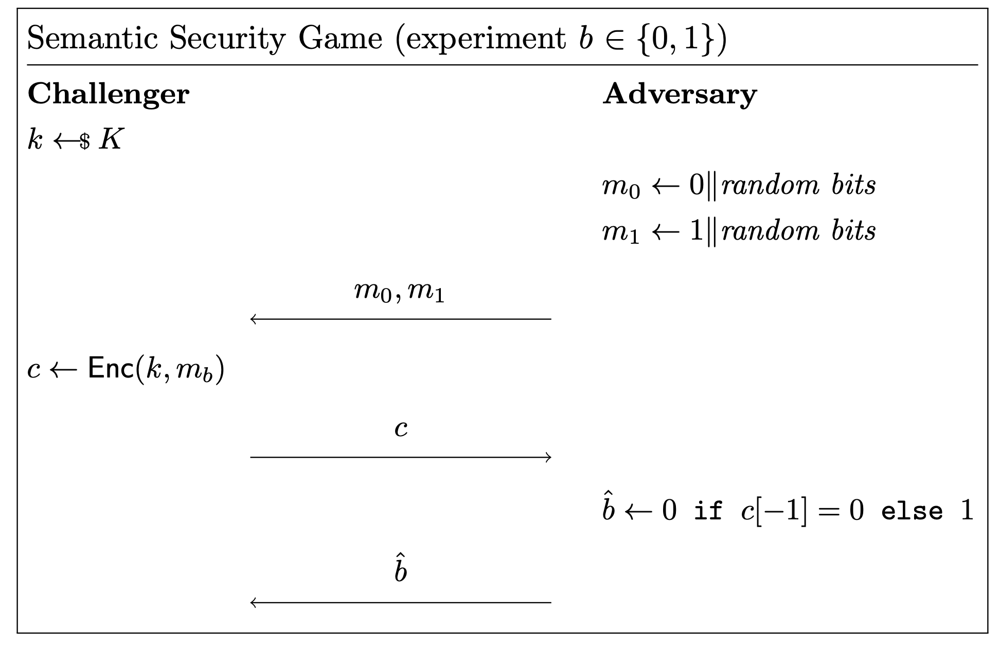

# Cryptography Worksheet 1 CPA (Chosen Plaintext Attack) Walkthrough

## Question 1

Consider an encryption scheme where the first bit of a message is equal to the last
bit of its ciphertext.
This encryption scheme is not perfectly secure - show an attack.

#### Semantic Security Game:

In cryptography, a semantic security game is an experiment involving a **challenger** and an **adversary**.

#### CPA (Chosen Plaintext Attack):

A chosen-plaintext attack (CPA) is an attack model which presumes that the attacker can obtain the ciphertexts for arbitrary plaintexts.

#### Indistinguishability:

If you encrypt two different messages, an attacker should **not** be able to distinguish which ciphertext corresponds to which message. If the attacker is able to do so, the encryption scheme is not perfectly secure.

## Solution

### Breakdown

---

### 1. Challenger and Adversary:

The diagram is divided into two columns. The left column (Challenger) represents the encryption process, and the right (Adversary) represents the attacker.

The interaction between them shows a semantic security experiment, where they exchange messages to test the encryption scheme's security.

### 2. 𝑘 ← $𝐾

The Challenger selects a random key 𝑘 from the key space 𝐾. The symbol `←$` means "select at random from."

### 3. m $_{0}$ ← 0 || random bits

The adversary chooses a message m $_{0}$ that begins with a 0 bit and is followed by random bits.

Note: || represents concatenation, meaning the 0 or 1 is joined with a sequence of random bits to form the message

### 4. m $_{1}$ ← 1 || random bits

The adversary chooses another message m $_{1}$ that begins with a 1 bit and is followed by random bits.

### 5. Sending the message

After constructing the messages m $_{0}$ and m $_{1}$, The adversary sends the message to the attacker.

### 6. c ← Enc(k,m $_{b}$)

The challenger encrypts the messages sent by the adversary (b represents either 0 or 1) 